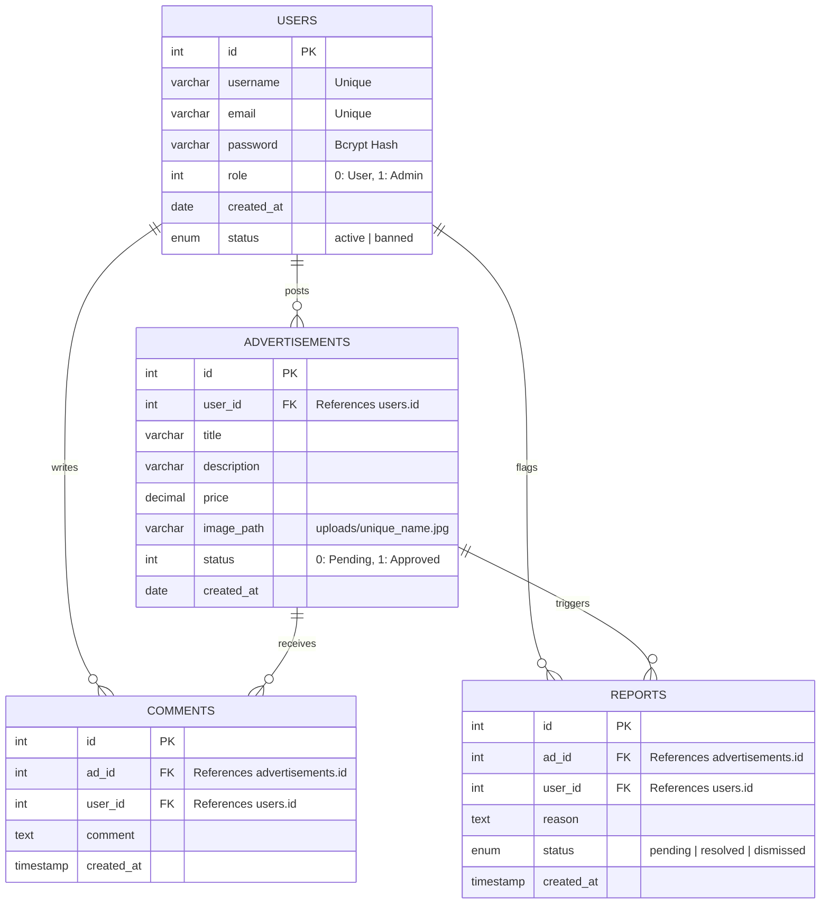

# 🏷️ BuySel.lk - Classifieds & Advertising Platform

BuySel.lk is a premium, modern, responsive, and robust **Classifieds and Advertising Web Application** built using native **Object-Oriented PHP** and a clean, custom-built **Model-View-Controller (MVC) architectural pattern**. Designed with a focus on seamless user experience and modern design patterns, the platform enables registered users to post, manage, search, and browse high-quality advertisements for vehicles, electronics, and various products.

The platform boasts custom administrative dashboards for platform moderation, active user management, real-time platform metrics, and comprehensive flagging/reporting systems to ensure content safety and integrity.

---

## 🌟 Premium Features

### 👤 Secure User Lifecycle & Authentication
- **Secure Registration & Login**: User credentials are authenticated and encrypted using PHP's native `password_hash()` standard with the `PASSWORD_DEFAULT` (bcrypt) algorithm.
- **Role-Based Access Control (RBAC)**: Privileges are automatically isolated using role flags in the database, partitioning views and dashboard controls for **Standard Users** vs. **Administrators**.
- **Account State Controls**: Admin-driven user status cycles supporting `active` and `banned` states, locking down compromised or malicious accounts dynamically.
- **Input Validation & Sanitization**: Comprehensive server-side validations for email syntax patterns, passwords, and username lengths.

### 📢 Dynamic Advertisement Management
- **Ad Posting Pipeline**: Authorized users can easily publish advertisements detailing title, description, pricing, and high-resolution product images.
- **Robust Image Processing**: Validates uploaded media file types using `getimagesize()` (preventing malicious payloads) and generates unique time-prefixed filenames to completely bypass namespace collisions.
- **Pending/Approved Workflows**: Ads start in a pending state (`status = 0`) for strict moderation and require administrator approval before appearing in public searches or recommendations.

### 🔍 Advanced Search & Real-time Discovery
- **Full-Text Match Queries**: Front-page dynamic search functionality, filtering active advertisements by title, content keywords, or the poster's username.
- **Curated Recommendations**: Displays only approved/active ads (`status = 1`) on the landing page, offering visitors a dynamic shopping feed.

### 💬 Social & Moderation Ecosystem
- **Interactive Commenting**: Enables registered users to query posters and provide reviews or inquiries directly underneath advertisements, sorted chronologically.
- **Reporting & Flagging Mechanism**: Community-driven reporting allows users to flag suspicious ads with a custom reason, immediately routing them to the Administrator's queue for rapid moderation.

### 🛡️ Full Admin Moderation Suite (Control Panel)
- **Real-time Analytics Dashboard**: Instant widgets tracking Total Users, Total Ads, Active Ads, Pending Approval Ads, and Pending Report Flags.
- **Ad Lifecycle Control**: Multi-action panel to approve pending posts, deactivate misleading posts, or permanently purge advertisements violating guidelines.
- **User Account Moderation**: Interactive user list with search, profile views, and instant toggle actions to `ban` or `unban` users.
- **Integrated Report Solver**: Displays all pending flags on advertisements, showing the reporter, ad title, reason, and date. Admins can dismiss claims or delete flagged ads instantly.

---

## 🛠️ Technological Architecture & Stack

### Backend Powerhouse
- **Native PHP 8.x**: Built using clean OOP classes, encapsulation, static factory utilities, and strict controller logic.
- **MySQL / MariaDB**: Core relational data storage utilizing `mysqli` prepared statements to guarantee protection against **SQL Injection (SQLi)** attacks.

### Modern Frontend Aesthetics
- **Responsive Layout Architecture**: Built entirely from scratch using mobile-first semantic HTML5 and vanilla CSS3.
- **Visual Design Elements**: Features glassmorphic top headers, organic visual backdrop blobs, curated interactive dark-mode components, and custom CSS variables for uniform color palettes.
- **Interactive Micro-animations**: Micro-animations on search entries, hover scales on ad cards, smooth side navigation slides, and clean button transitions.
- **Zero-Dependency Components**: Custom vanilla JavaScript modals, prompt confirmation alerts (e.g. secure logouts), and flash messages.

---

## 📂 Project Architecture & Codebase Map

The project implements a classic, clean **MVC pattern** to split logic, database schemas, templates, and public assets:

```text
Advertising-Website/
├── app/                        # Main Application Layer
│   ├── config/                 # Core System Configuration
│   │   ├── config.php          # Domain constants, URL paths, and site names
│   │   └── database.php        # MySQL Connection Class (static mysqli wrapper)
│   ├── controllers/            # Controller Layer (orchestrates requests & logic)
│   │   ├── AdController.php           # Handles ad creation, image uploads, price checks
│   │   ├── AdInteractionController.php # Controls comments and reporting workflows
│   │   ├── AdminController.php        # Handles metrics, user status, ad approval queues
│   │   └── AuthController.php         # Regulates register, login, and session lifecycles
│   ├── models/                 # Model Layer (database wrappers & ORM-like entities)
│   │   ├── Advertisement.php          # Ad retrieval, saving, metrics, and commenting
│   │   └── User.php                   # User authentication, status updates, counts
│   ├── resources/              # SQL schemas and database seed scripts
│   │   └── ad_sysytem_new.sql         # Main MariaDB database dump
│   └── views/                  # View Layer (presentation templates)
│       ├── admin/              # Dashboard pages (dashboard, reports, user listings)
│       ├── ads/                # Advertisement views (list, creation, details)
│       ├── auth/               # Access views (login, registration templates)
│       ├── home/               # Homepage layout
│       └── layout/             # Component layouts (header, footer, nav, search)
├── public/                     # Public Web Server Root (front-facing entrypoint)
│   ├── assets/                 # Custom static resources
│   │   ├── css/                # Component styles (structured by views)
│   │   ├── images/             # UI branding, default pictures, and logos
│   │   └── js/                 # Pure JS interaction scripts and popups
│   ├── uploads/                # Safe directory for uploaded classified images
│   └── index.php               # Front controller/landing entry point
└── .gitignore                  # Git ignore directories and configurations
```

---

## 💾 Relational Database Schema

The database model revolves around four primary entities designed with **referential integrity constraints** (`ON DELETE CASCADE`):



---

## 🚀 Step-by-Step Installation & Local Setup

Deploy the application locally in minutes using any standard PHP environment like **XAMPP**, **WAMP**, or **Laragon**:

### 1. Prerequisites
Ensure the local server meets the following requirements:
- **PHP**: version 8.0 or newer
- **MySQL / MariaDB**
- **Apache Server** (configured with the `rewrite_module` if virtual hosts are used)

### 2. Clone the Repository
Clone the codebase into your web server's document root (e.g. `C:\xampp\htdocs\dse\CW-MyGit\Advertising-Website`):
```bash
# Navigate to web directory
cd C:\xampp\htdocs\dse\CW-MyGit\

# Clone or copy the folder
git clone <repository-url> Advertising-Website
```

### 3. Import the Relational Schema
1. Boot your Apache and MySQL engines using your local Control Panel.
2. Go to **phpMyAdmin** (`http://localhost/phpmyadmin/`).
3. Create a new database exactly named `ad_sysytem` with collation `utf8mb4_general_ci`.
4. Click on the `ad_sysytem` database name in the sidebar, open the **Import** tab.
5. Choose the SQL schema script located at:
   `[Project-Root]/app/resources/ad_sysytem_new.sql`
6. Execute the import to construct tables and load pre-configured seed records.

### 4. Configuration Check
Open `app/config/config.php` and verify the settings align with your setup:
```php
define('DB_HOST', 'localhost');
define('DB_USER', 'root');
define('DB_PASS', ''); // Set your MySQL password if applicable
define('DB_NAME', 'ad_sysytem');

// Adjust URLROOT if you host on a custom virtual host
define('URLROOT', 'http://localhost/dse/CW-MyGit/Advertising-Website/public');
define('SITENAME', 'BuySel.lk');
```

### 5. Access the Platform
Navigate to the front controller in your browser:
```text
http://localhost/dse/CW-MyGit/Advertising-Website/public/index.php
```

---

## 🔑 Preseeded Demo Accounts

Use these preseeded logins within the relational script for immediate functional testing:

### 🛡️ Administrator Credentials
- **Username**: `admin`
- **Password**: `admin`
- **Permissions**: Full access to the Admin Panel (`/app/views/admin/dashboard.php`), user status toggles (`ban`/`unban`), pending ad approvals, and report moderation.

### 👤 Standard User Credentials
- **Username**: `user`
- **Password**: `user`
- **Permissions**: General navigation, posting classified ads, submitting comments, and flagging/reporting posts.

---

## 🛡️ Robust Security Measures Implemented
1. **Prepared Statements**: Core database queries utilize MySQL standard parameterized parameters to neutralize **SQL Injection (SQLi)** vulnerabilities.
2. **Password Cryptography**: Avoids storing plaintext passwords; utilizes secure industry-standard `password_hash()` (Bcrypt).
3. **MIME & Image Validation**: Evaluates uploads using `getimagesize()` to block malicious shell scripts disguised as image extensions.
4. **Strict Authentication Checks**: Routes admin actions or user creations through structural session validation checks to prevent unauthorized access bypasses.
